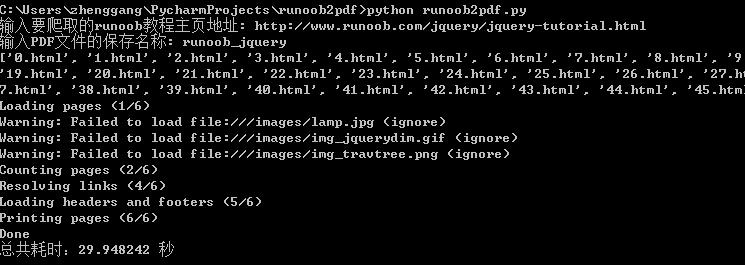
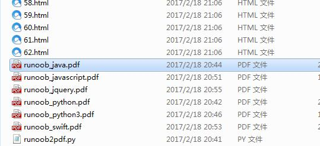
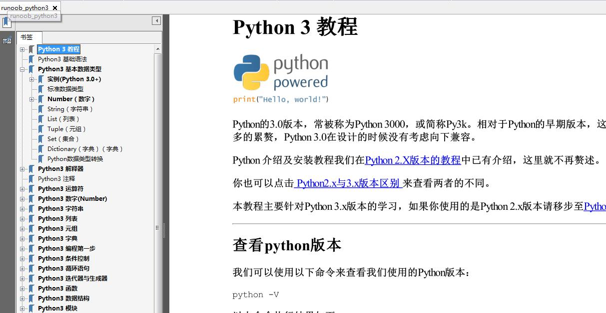
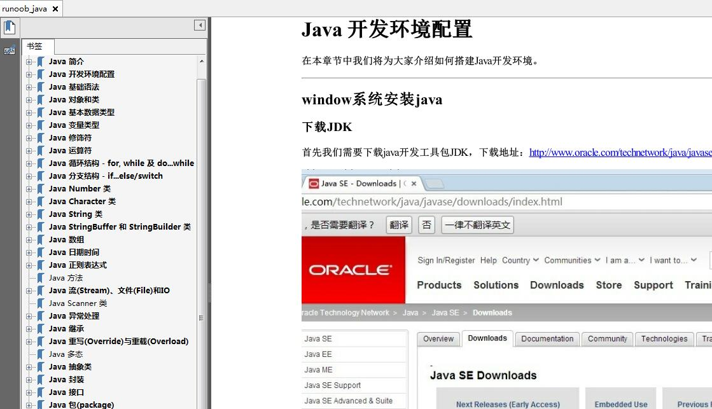

#Python 爬虫：把runoob网站上的各类教程转换成 PDF 电子书

### 系统要求
python3.4以上版本, 不支持python2.x


### 准备工具

requests、beautifulsoup 是爬虫两大神器，reuqests 用于网络请求，beautifusoup 用于操作 html 数据。有了这两把梭子，干起活来利索。scrapy 这样的爬虫框架我们就不用了，这样的小程序派上它有点杀鸡用牛刀的意思。此外，既然是把 html 文件转为 pdf，那么也要有相应的库支持， wkhtmltopdf 就是一个非常的工具，它可以用适用于多平台的 html 到 pdf 的转换，pdfkit 是 wkhtmltopdf 的Python封装包。click是一款命令行工具参数工具，用于在命令行传递参数。

首先安装好下面的依赖包

```python
pip install requests
pip install beautifulsoup4
pip install pdfkit
pip install click
```

### 安装 wkhtmltopdf
Windows平台直接在 [http://wkhtmltopdf.org/downloads.html](http://wkhtmltopdf.org/downloads.html) 下载稳定版的 wkhtmltopdf 进行安装，安装完成之后把该程序的执行路径加入到系统环境 $PATH 变量中，否则 pdfkit 找不到 wkhtmltopdf 就出现错误 “No wkhtmltopdf executable found”。Ubuntu 和 CentOS 可以直接用命令行进行安装

```shell
$ sudo apt-get install wkhtmltopdf  # ubuntu
$ sudo yum intsall wkhtmltopdf      # centos
```

### 运行
```python
python runoob2pdf.py
```

### 说明
执行 python runoob2pdf.py后
会提示让你输入
1. runoob网站上的教程主页地址，主页地址就是网页顶部菜单上对应的地址。
   如效果图。
2. 输入保存的pdf文件名。

### 效果图





### 特别说明
感谢《Python 爬虫：把廖雪峰的教程转换成 PDF 电子书》的作者liuzhijun，本项目的代码都是基于他的代码改动后实现。

### Contact me
>作者：jadentseng 
>微信： cheney2010  


